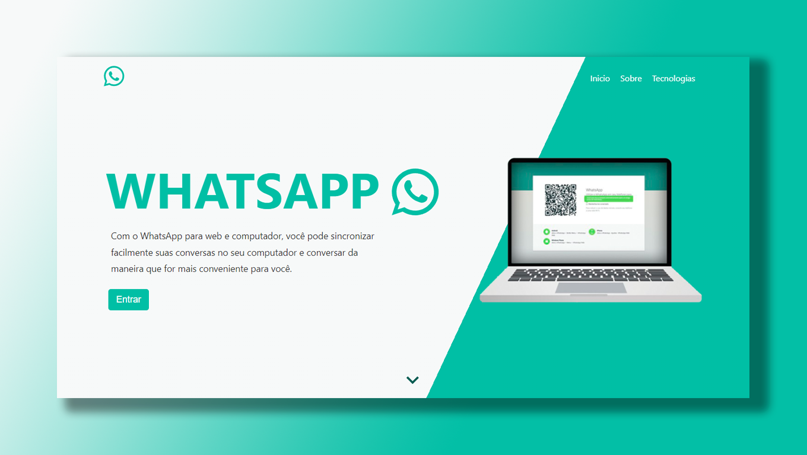

    

<h1 align="center"> Clone do Whatsapp com ReactJs</h1>

    <a href="#sobre">Sobre</a> • 
    <a href="#features">Features</a> • 
    <a href="#demo">Demo</a> • 
    <a href="#tecnologias">Tecnologias</a> • 
    <a href="#licenca">Lincença</a> • 
    <a href="#autor">Autor</a> 

### Sobre

O "PokeForge" é uma plataforma desenvolvida com Vite e React.js, integrando Docker, Hasura e PostgreSQL. Oferece uma interface dinâmica para explorar Pokémons da PokeAPI, montar times de batalha, ver detalhes e buscar por nome. É uma experiência completa para fãs de Pokémon.

### Features

- [x] Montar seu time Pokémon com api Hasura e PostgreSQL
- [x] Listagem de pokemons com pokeApi
- [x] Ver detalhes dos Pokémons

### Demo
<h1 align="center">
    
</h1>

(Preview)

### Tecnologias

As seguintes ferramentas 🛠 foram usadas na construção do projeto:

<table>
    <tr>
        <td><a href="https://www.javascript.com/">Javascript</a></td>
        <td><a href="https://pt-br.reactjs.org/">ReactJs</a></td>
        <td><a href="https://developers.facebook.com/">Api do Facebook</a></td>
        <td><a href="https://firebase.google.com/?hl=pt">Firebase</a></td>
        <td><a href="https://mui.com/pt/">MaterialUI</a></td>
    </tr>
    <tr>
        <td>ECMAScript 2018</td>
        <td>17.0.2*</td>
        <td>12.0*</td>
        <td>10.0.1*</td>
        <td>5.2.8*</td>
    </tr>
</table>

### Licenca

O Clone do Whatsapp é um software de código aberto licenciado sob a [MIT license](http://opensource.org/licenses/MIT).

### Referencias

Dedicação ao canal https://www.youtube.com/channel/UCw9mYSlqKRXI6l4vH-tAYpQ 

### Autor

> Made by GUILHERME ROCHA 👉 [See my LinkedIn](https://www.linkedin.com/in/guilherme-rocha-7b3a69220/) • GitHub [@Guilherme-devcode](https://github.com/Guilherme-devcode)

